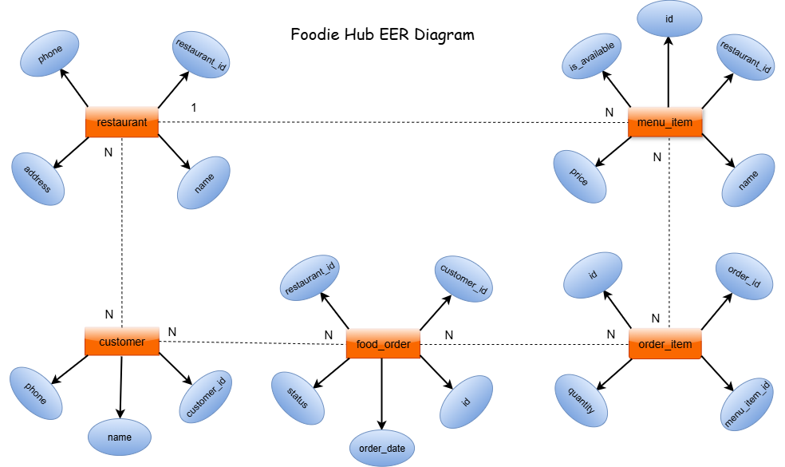

# 🍽️ FoodieHub Backend Project

This is the backend project for **FoodieHub**, a simple food ordering system built with Node.js and PostgreSQL.

---

# 📂 Project Structure

backend/
├── controllers/ # Route handler functions
├── models/ # Database queries
├── routes/ # API routes
├── db/ # Database config
├── .env.example # Sample environment variables
├── schema.sql # SQL file to create tables
├── reset.sql # Optional reset file to drop and recreate tables
├── server.js # Application entry point

---

## EER Diagram



## ⚙️ Technologies Used

- Node.js
- Express.js
- PostgreSQL
- pg module
- dotenv

---

## 📌 How to Run the Project

1. **Clone the Repository**
   ```bash
   git clone https://github.com/adela2003/foodiehub-project.git
   cd foodiehub-project/backend
   ```
2. Create .env File
   Create a .env file using the provided .env.example.
   DB_HOST=localhost
   DB_PORT=5432
   DB_USER=postgres
   DB_PASSWORD=yourpassword
   DB_NAME=foodiehub

```
3.Create Database
In PostgreSQL, create a database named foodiehub.
```

4.Run the Schema
psql -U postgres -d foodiehub -f schema.sql

```

5.(Optional) Reset Tables
To drop and recreate tables:

psql -U postgres -d foodiehub -f reset.sql
```

6.Install Dependencies

npm install

```
7. Run the Server

nodemon server.js
```

🧪Testing with Postman
You can use Postman to test the following API routes:

Restaurants: GET /restaurants, POST /restaurants, etc.

Customers: GET /customers, POST /customers, etc.

Menu Items: GET /menu-items, POST /menu-items, etc.

Orders: GET /orders, POST /orders, etc.

Order Items: GET /order-items, POST /order-items, etc.

See the Postman Collection for full details.

```


📎 Author
Adela Ahmadi
Backend Student – 2025
Herat, Afghanistan

```
